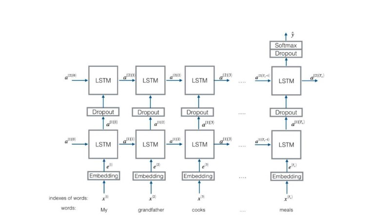

# HW5 Report

## Architecture



After embedding, data passes through 2 LSTM layers (bidirectional) and the get out of the last LSTM forwarding output into a FCLayer.

## Records

### Training Performance

<center>
    
    <p>
        <font>
        	training loss
        </font>
    </p>
</center>

<center>
    
    <p>
        <font>
        	training accuracy
        </font>
    </p>
</center>

<center>
    
    <p>
        <font>
        	validation loss
        </font>
    </p>
</center>

<center>
    
    <p>
        <font>
        	validation accuracy
        </font>
    </p>
</center>

| last Validation Loss | last validation accuracy |
| -------------------- | ------------------------ |
| 1.351                | 42.05%                   |

### Test result

| TEST LOSS | TEST ACCURACY |
| --------- | ------------- |
| 1.318     | 43.35%        |


## Hyperparameters

```python
# hyperparameters
    learning_rate = 0.0001
    num_epochs = 200
    batch_size = 512
    lbd = 0.0001
    dropout = 0.5
    n_layers = 2

    EMBEDDING_DIM = 300
    HIDDEN_DIM = 128
    OUTPUT_DIM = 5
    BIDIRECTIONAL = True
```

In the plots, though it's generally converging, the bouncing is seriously violently (even less smooth in the beginning). I enlarged batch_size and decreased learning rate, and used Adam as optimizer to make it go more smoothly. But still, as the data set is limited, that's hardly to avoid.
